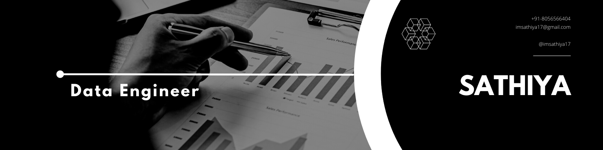

 

 

# Hi there, I'm Sathiya

I am a highly skilled and experienced data engineer and full-stack developer with over 12 years of experience. Throughout my career, I have worked on a variety of projects and have developed a deep expertise in designing and implementing robust solutions to complex problems. I am adept at working with a range of programming languages and frameworks, and have extensive experience in cloud computing and databases. 

I am extremely passionate about data engineering, designing & integrating user interfaces, API developement, Blockchain technologies and am always eager to learn more and stay up-to-date with the latest technologies and trends.

I am a true believer in the power of technology to transform industries and make a positive impact on the world, and I am committed to using my skills and knowledge to contribute to this vision.

In my free time, I enjoy listening to music, watching tennis matches, and following cricket tournaments. These hobbies help me to unwind and take my mind off work while also allowing me to stay connected to my interests outside of my career.

Interested in AI, Blockchain, and Cloud based technologies.

- 🏢 &nbsp;Data engineer, Full stack engineer &  Mentor
- 🌱 &nbsp;Currently learning Solidity & Rust.
- 💬 &nbsp;I would be happy to help you learn Data engineering, Data quality, Data visualizations, API & Web development

## Open to

- Work
- Mentorship
- Freelance projects
- Collaborations to build something great

If you'd love to talk, just send me a [DM on Twitter](https://twitter.com/imsathiya17) or email me

## Tech Stack & Tools

I work with different technologies and languages, but my favorites are **JavaScript**, **Python**, **Node.js**, and **Express.js**.

   &emsp;
   &emsp;
   &ensp;
   &ensp;
   &ensp;
   &emsp;
   &emsp;
   &emsp;
   &emsp;
   &emsp;
   &emsp;

